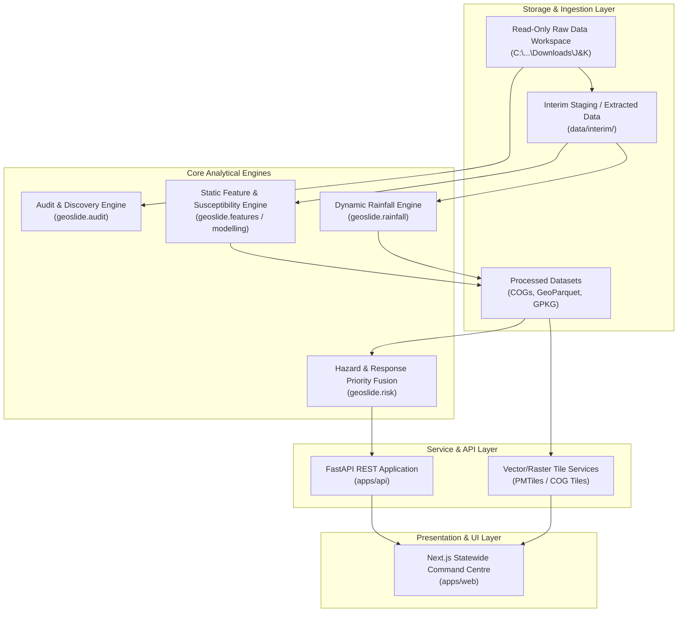

# GeoSlide-JK System Architecture & Design Document

---

## 1. Executive Architecture Summary

GeoSlide-JK is structured as a decoupled, multi-tier geospatial system. High-performance raster/vector processing and ML inference are performed in Python backends, served via Fast-API tile and REST endpoints, and visualized through a modern React/Next.js map-first frontend.

---

## 2. Key Component Specifications

### 2.1 Static Susceptibility Module (`geoslide.modelling`)
- **Algorithms**: XGBoost Classifier with spatial block cross-validation.
- **Predictors**: 20+ terrain, geological, structural, and land-cover rasters aligned to 100m UTM grid (`EPSG:32643`).
- **Explainability**: SHAP (SHapley Additive exPlanations) values per location prediction.

### 2.2 Dynamic Rainfall Engine (`geoslide.rainfall`)
- **Climatology**: Historical daily gridded IMD rainfall percentiles (90th, 95th, 99th).
- **Near-Real-Time Trigger**: GPM IMERG 30-minute to 72-hour cumulative accumulation.
- **Fallback**: India-WRIS station network data validation.

### 2.3 Web Delivery & Tile Strategy (`geoslide.tiling`)
- Raw heavy rasters (2+ GB) are NEVER transferred directly to the frontend.
- Rasters are served via Cloud-Optimized GeoTIFFs (COG) / TiTiler.
- Vectors (roads, boundaries, landslide inventories) are served via PMTiles / MapLibre vector tiles.
